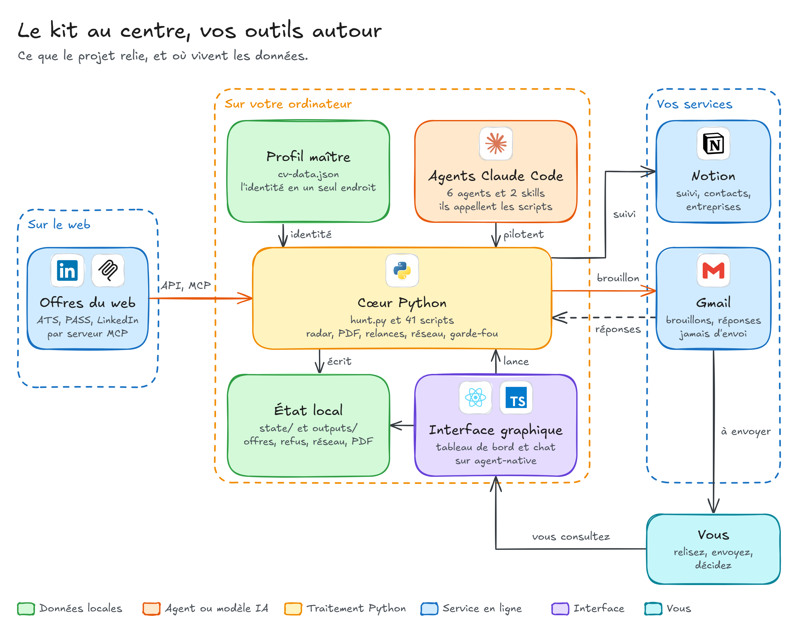
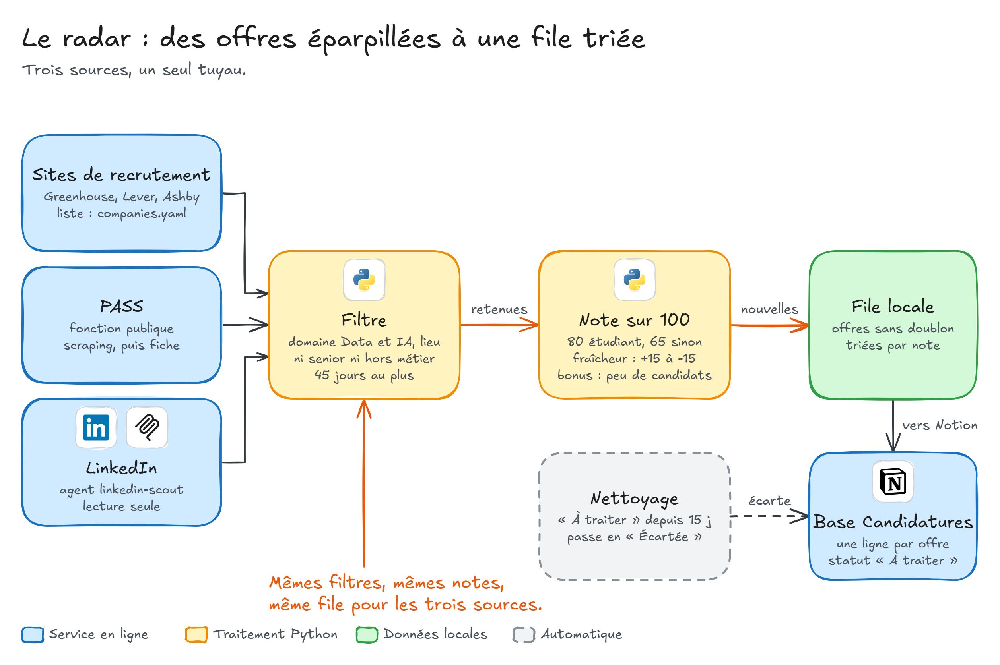
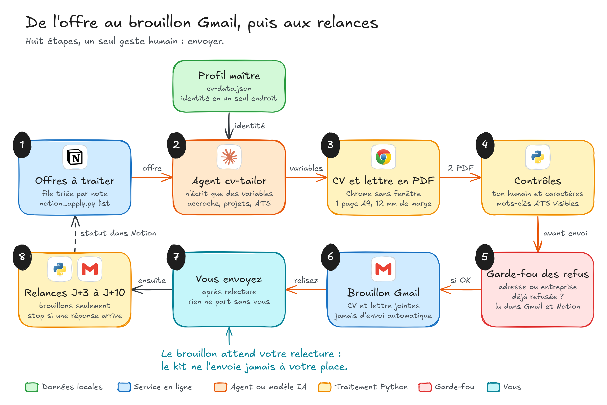
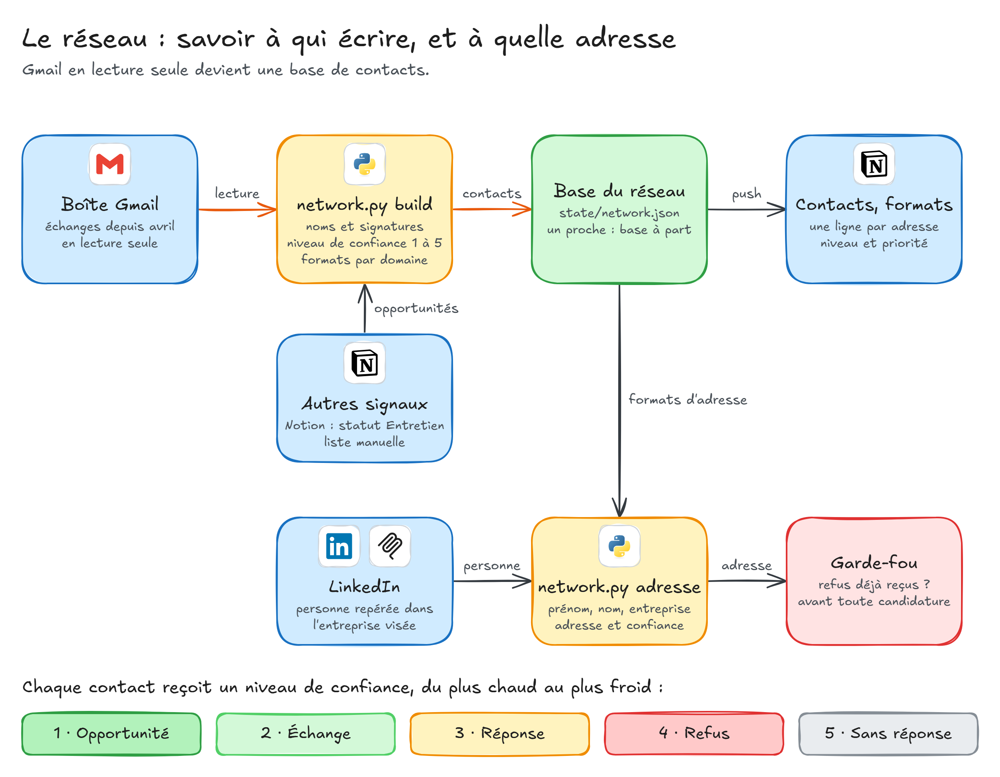
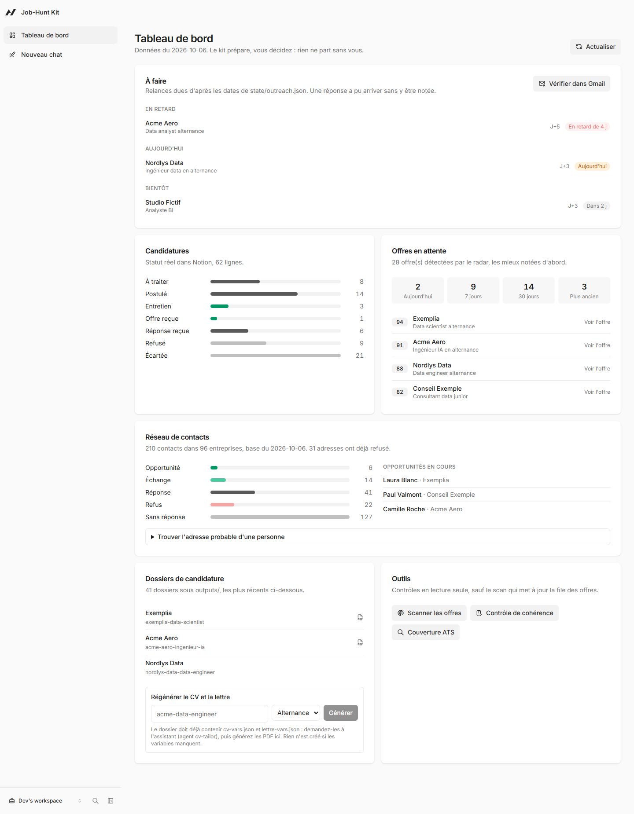
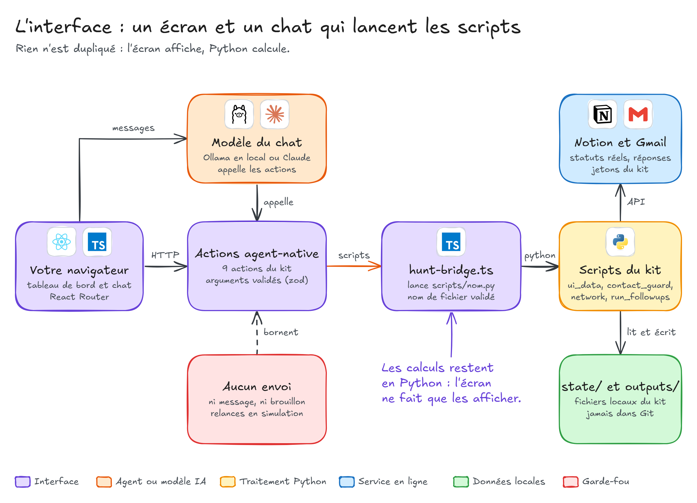

<div align="center">

# Job-Hunt Kit

**Veille d'offres, scoring et candidatures sur-mesure — du repérage de l'annonce au brouillon Gmail prêt à envoyer, sans jamais perdre la main.**

CV et lettre de motivation calibrés 1 page A4 · base Notion connectée · brouillons Gmail OAuth · relances J+3 à J+10 · réseau de contacts par niveau de confiance · radar LinkedIn (MCP)


</div>

> **Le kit prépare, vous décidez.** Les emails partent en brouillons Gmail, jamais en envoi automatique. Les formulaires web sont remplis et vérifiés, mais la soumission reste un geste humain. Chaque candidature est un dossier de fichiers lisibles et modifiables, pas une boîte noire.

## Sommaire

1. [Fonctionnement](#fonctionnement)
2. [Prérequis](#prérequis)
3. [Démarrage rapide](#démarrage-rapide)
4. [Le design system du CV](#le-design-system-du-cv)
5. [Commandes du quotidien](#commandes-du-quotidien)
6. [Connexions (Gmail, Notion, LinkedIn, Excalidraw)](#connexions)
7. [Interface graphique](#interface-graphique)
8. [Structure du projet](#structure-du-projet)
9. [Sous-agents et skills (Claude Code)](#sous-agents-et-skills-claude-code)
10. [Dépannage et FAQ](#dépannage-et-faq)
11. [Licence](#licence)

---

## Fonctionnement

Le kit repose sur un pipeline en trois temps :


1. **Radar.** Les offres (PASS, WTTJ, Indeed/HelloWork, ATS directs Greenhouse, Teamtailor, Ashby, Lever, LinkedIn via MCP) sont dédupliquées, notées sur 100 et rangées dans la base Notion « Candidatures ».
2. **Candidature.** Pour une offre « À traiter », le CV et la lettre sont personnalisés depuis le profil maître puis rendus en PDF A4 (Chrome headless). L'adresse du destinataire passe le garde-fou des refus, puis le kit prépare un brouillon Gmail ou remplit et vérifie le formulaire. L'envoi reste votre geste.
3. **Suivi.** Les relances J+3, J+5, J+7 et J+10 s'arrêtent dès qu'une réponse arrive et mettent le statut à jour dans Notion. Le réseau de contacts propose l'adresse probable d'une personne et la soumet au même garde-fou.

Deux principes structurent tout le reste :

- **Une seule source de vérité.** Le contenu maître du CV vit dans `templates/cv/cv-data.json` ; chaque candidature n'ajoute que des variables (`cv-vars.json`, `lettre-vars.json`) dans son dossier `outputs/<slug>/`.
- **La fiabilité avant la fonctionnalité.** Dates normalisées en ISO, contrôle de cohérence entre `outputs/`, l'état local et Notion, erreurs jamais silencieuses, audit anti-fuite de données personnelles à chaque partage.

### Vue d'ensemble



Le **cœur Python** (`hunt.py` et 41 scripts) fait le travail ; les **agents Claude Code** l'enchaînent quand vous travaillez avec un assistant ; l'**interface graphique** le montre à l'écran. Tout converge vers trois sorties : l'**état local** (`state/`, `outputs/`), **Notion** pour le suivi et des **brouillons Gmail** que vous seul envoyez.

### Le radar



Greenhouse, Lever et Ashby (par leurs API publiques), PASS (fonction publique) et LinkedIn (par un serveur MCP, en lecture seule) passent le **même filtre** et reçoivent une **note sur 100** : profil, fraîcheur de l'offre et, pour LinkedIn, bonus aux offres peu postulées. L'agent `job-scout` peut aussi chercher sur WTTJ, Indeed et HelloWork avec des outils de scraping. Les offres tombent dans une file locale sans doublon, puis dans Notion ; celles qui restent « À traiter » plus de 15 jours sont écartées.

### De l'offre au brouillon Gmail



L'agent `cv-tailor` n'écrit que des **variables** (accroche, projets retenus, mots-clés) : le contenu maître ne change jamais. Le CV tient sur **une page A4 avec 12 mm de marge**, sinon le kit retire des projets plutôt que de réduire les polices. Avant tout brouillon, le **garde-fou** vérifie que l'adresse ou l'entreprise n'a pas déjà refusé. Les relances à J+3, J+5, J+7 et J+10 sont aussi des brouillons, et **s'arrêtent dès qu'une réponse arrive**.

### Le réseau de contacts



Le kit lit votre boîte Gmail (en lecture seule) pour apprendre **à qui vous avez écrit et à quelle adresse** : chaque contact reçoit un **niveau de confiance** de 1 (opportunité) à 5 (sans réponse), et chaque entreprise un **format d'adresse** (`prenom.nom`, `p.nom`...) avec sa confiance. Pour une candidature spontanée, on repère la bonne personne sur LinkedIn et `network.py adresse` propose son adresse, après le garde-fou.

Chaque schéma est expliqué étape par étape dans **[docs/architecture.md](docs/architecture.md)**. Ils sont dessinés dans le style [Excalidraw](https://excalidraw.com), avec les logos des outils : les fichiers sources [`docs/diagrams/excalidraw/*.excalidraw`](docs/diagrams/excalidraw/) s'ouvrent sur excalidraw.com pour être retouchés à la main, et `python docs/diagrams/excalidraw/build.py` les régénère.

## Prérequis

| Besoin | Détail |
| :--- | :--- |
| Python 3.9 ou plus | `pip install -r requirements.txt` |
| Google Chrome ou Edge | rendu PDF headless (détection automatique, sinon variable `CHROME_PATH`) |
| Intégration Notion | token + page parente, pour la base « Candidatures » (recommandé) |
| Projet Google Cloud + API Gmail | pour les brouillons OAuth, les relances et le réseau de contacts (optionnel) |
| [uv](https://docs.astral.sh/uv/) + Claude Code | pour les serveurs MCP LinkedIn et Excalidraw (optionnel, voir [Connexions](docs/connexions.md)) |
| Node.js 22 ou plus + pnpm | pour l'[interface graphique](#interface-graphique) (optionnel) |

Pour le scraping stealth des offres PASS, le navigateur Chromium s'installe séparément (une seule fois) :

```bash
python -m patchright install chromium
```

## Démarrage rapide

### Option 1 — sans ligne de commande

- **Windows** : double-cliquez sur [`hunt.bat`](hunt.bat).
- **macOS / Linux** : lancez `./hunt.sh` ou `python3 hunt.py`.

Un menu interactif guide pas à pas :

```text
================================================================
JOB-HUNT KIT — MENU PRINCIPAL
================================================================
  1. Generer une candidature sur-mesure (CV + Lettre PDF)
  2. Lancer la veille d'offres (ATS & PASS)
  3. Tableau de bord & Suivi des candidatures
  4. Preparer les brouillons d'emails Gmail
  5. Previsualiser mon CV PDF (Alternance / Stage)
  6. Synchroniser avec Notion
  7. Modifier mon profil ou theme graphique
  8. Verifier l'installation & Lancer les tests
  0. Quitter
================================================================
Choix [0-8] :
```

### Option 2 — ligne de commande unifiée (`hunt.py`)

| Action | Commande | Description |
| :--- | :--- | :--- |
| Menu interactif | `python hunt.py` | Ouvre l'assistant visuel guidé. |
| Initialisation | `python hunt.py init` | Configure profil, thème graphique et Notion. |
| Prévisualiser le CV | `python hunt.py cv` | Compile et ouvre instantanément le CV 1 page A4. |
| Créer une candidature | `python hunt.py apply <slug>` | Assistant guidé : dossier, CV et lettre PDF. |
| Veille automatisée | `python hunt.py scan` | Détecte les offres PASS et ATS, triées par récence. |
| Tableau de bord | `python hunt.py stats` | Entonnoir de conversion, KPIs, relances en retard. |
| Brouillons Gmail | `python hunt.py draft --top 5` | Prépare les emails avec CV joint dans vos brouillons. |
| Diagnostic | `python hunt.py status` | Vérifie Chrome, Notion et Gmail. |
| Import de profil | `python hunt.py profile import <fichier>` | Extrait le texte d'un CV existant (PDF, DOCX, TXT, MD). |
| Tests | `python hunt.py test` | Exécute la suite automatisée (274 tests). |
| Pack de partage | `python hunt.py kit` | Génère un zip propre, sans secrets. |

## Le design system du CV

- **Strictement 1 page A4** (210 mm × 297 mm, marges zéro à l'impression, calibration print `@page`).
- **Structure en deux zones** :
  - *Sidebar gauche (65 mm)* : nom, titre badge, contact, formation, compétences réordonnables, stack technique catégorisée, savoir-être, langues, certifications, intérêts.
  - *Zone principale (145 mm)* : bannière dynamique avec tags d'offre (durée, rythme, lieu), profil et accroche ciblée, timeline d'expériences avec bilans chiffrés (`✓ Bilan : ...`), projets d'envergure complets.
- **Optimisation ATS en deux couches** :
  - une couche invisible blanche sur blanc (1 px) en pied de page (`.ats-hidden-layer`) porte les mots-clés de l'offre ;
  - les métadonnées internes du PDF (`/Keywords`, `/Author`, `/Title`, `/Subject`) sont injectées automatiquement.
- **Thèmes interchangeables** :

| Thème | Couleur | Caractère |
| :--- | :--- | :--- |
| `navy` | `#323B4C` | Classique corporate (défaut) |
| `emerald` | `#155E4C` | Moderne et dynamique |
| `bordeaux` | `#7A1F2B` | Élégant et institutionnel |
| Personnalisé | `#RRGGBB` | Toute couleur hexadécimale |

## Commandes du quotidien

### 1. Veille — plateforme PASS (fonction publique)

```bash
# 1. Scraper la liste des offres PASS selon vos filtres
python scripts/scrape_pass.py

# 2. Enrichir avec le détail des fiches et extraire les emails recruteurs
python scripts/enrich_pass_offers.py

# 3. Filtrer et noter les offres d'alternance / stage
python scripts/filter_alternance_pass.py

# 4. Pousser les offres retenues vers votre base Notion
python scripts/push_pass_to_notion.py

# 5. (Optionnel) Exporter en CSV ou afficher une synthèse
python scripts/export_pass_csv.py
python scripts/summary_pass.py
```

### 2. Veille — ATS entreprises et scraping furtif

```bash
# Radar ATS direct (Greenhouse, Lever, Ashby) sur vos cibles de config/companies.yaml
python hunt.py scan --ats

# Extraction furtive d'une annonce web (contournement des protections)
python scripts/scrape_scrapling.py "https://example.com/job-offer" --stealth
```

### 3. Gestion de la file Notion

```bash
# Lister les offres au statut « À traiter », triées par score décroissant
python scripts/notion_apply.py list

# Marquer une offre comme postulée
python scripts/notion_apply.py mark --url "https://..." --statut Postulé --date 2026-09-01
```

### 4. Personnalisation et génération CV + lettre

Pour chaque offre, créez un dossier `outputs/<slug>/` (ex. `outputs/acme-consultant-data/`) contenant deux fichiers de variables.

`cv-vars.json` :

```json
{
  "titre": "Consultant Data & IA",
  "accroche": "Diplômé en ingénierie Data Science, je conçois des pipelines ETL et modèles prédictifs à fort impact métier.",
  "competences_ordre": ["Data Engineering", "Machine Learning"],
  "projets_selection": ["Cloud Healthcare Unit", "HR Analytics"],
  "mots_cles_ats": ["Python", "SQL", "ETL", "Power BI", "Scikit-learn", "GCP"]
}
```

`lettre-vars.json` :

```json
{
  "entreprise": "Acme Conseil",
  "poste": "Consultant Data & IA",
  "type": "alternance",
  "destinataire": "Madame, Monsieur",
  "objet": "Candidature au poste de Consultant Data & IA",
  "paragraphes": [
    "Votre offre de Consultant Data & IA a particulièrement retenu mon attention...",
    "Mon parcours m'a permis de développer une double compétence en modélisation et data engineering...",
    "Je serais ravi de vous rencontrer afin de vous exposer mes motivations."
  ]
}
```

Puis lancez :

```bash
python hunt.py apply acme-consultant-data --profile alternance
```

Les fichiers `CV_<Prenom>_<NOM>.pdf` et `Lettre_<Prenom>_<NOM>.pdf` sont générés instantanément dans le dossier.

### 5. Brouillons Gmail (OAuth)

```bash
# Brouillon ciblé avec CV en pièce jointe
python hunt.py draft \
  --to "recruteur@entreprise.com" \
  --subject "Candidature Alternance — Consultant Data" \
  --body "Bonjour, veuillez trouver ci-joint mon CV..." \
  --cv "outputs/acme-consultant-data/CV_Prenom_NOM.pdf"

# Ou générer automatiquement les 5 meilleurs brouillons pour les offres PASS
python hunt.py draft --top 5
```

### 6. Relances et contrôle de cohérence

```bash
# Aperçu (dry-run, rien n'est écrit) : qui a répondu, qui est dû pour une relance
python scripts/run_followups.py

# Applique : crée les brouillons J+3/5/7/10 dus, arrête la séquence sur réponse détectée,
# synchronise state/outreach.json et Notion. Mode brouillons uniquement : aucun envoi
# automatique, par conception.
python scripts/run_followups.py --apply

# Vérifie que outputs/, state/outreach.json et Notion racontent la même histoire
python scripts/check_consistency.py
```

`hunt.py stats` affiche aussi le statut réel des candidatures (lu directement dans Notion) et les relances en retard.

### 7. Mettre à jour votre profil depuis un CV existant

Vous avez déjà un CV (PDF, DOCX, TXT ou MD) et voulez importer votre profil, poste visé, domaine de recherche, expériences, projets ou compétences dans le kit :

```bash
python hunt.py profile import chemin/vers/mon-cv.pdf
```

La commande extrait le texte du document. La fusion réelle dans `templates/cv/cv-data.json` se fait ensuite avec Claude Code (`/import-profile chemin/vers/mon-cv.pdf`) : le skill compare le contenu du document à votre profil actuel et vous montre le diff proposé — **rien n'est jamais écrit sans confirmation explicite**, et aucune information absente du document n'est inventée.

### 8. Partager le kit sans secrets

```bash
python hunt.py kit
```

Produit une archive `job-hunt-kit_<date>.zip` après audit garanti de l'absence de secrets (`.notion_token`, `credentials.json`, `gmail_token.json`, `.env`, données privées). L'audit scanne le contenu de **tous** les fichiers texte inclus — pas seulement le profil — pour l'email et le téléphone réels du candidat, chargés dynamiquement depuis le profil actif, jamais codés en dur dans le script lui-même.

### 9. Garde-fou avant envoi : ne jamais relancer qui a dit non

```bash
# Reconstruit la liste des refus (mails reçus avec une formule de refus + lignes Notion « Refusé »)
python scripts/contact_guard.py --refresh

# Verdict pour une ou plusieurs adresses : bloqué (même personne), attention (même entreprise, refus récent), ok
python scripts/contact_guard.py recruteur@entreprise.fr
```

Les relances (`run_followups.py`) et les brouillons (`create_gmail_draft.py`) consultent cette liste d'office et s'arrêtent sur une adresse bloquée. Un accusé de réception ou un « j'ai transmis votre CV » n'est pas un refus.

### 10. Réseau de contacts et adresse probable

```bash
# Toutes les personnes avec qui vous avez échangé depuis une date, et le format d'adresse de chaque entreprise
python scripts/network.py build --depuis 2026-04-01

# Dans Notion : bases « Contacts » (avec niveau de confiance) et « Entreprises et formats d'adresse »
python scripts/network_notion.py --page <url de la page partagée avec l'intégration>   # première fois
python scripts/network_notion.py                                                       # mises à jour

# Une offre arrive d'une entreprise connue : adresse probable de la personne repérée sur LinkedIn
python scripts/network.py adresse "<entreprise ou domaine>" Prénom Nom
```

Chaque contact est classé du plus chaud au plus froid : opportunité, échange, réponse, refus, sans réponse. Détails et règles dans [docs/connexions.md](docs/connexions.md#réseau-de-contacts).

### 11. Radar LinkedIn (avec Claude Code)

Avec le serveur MCP LinkedIn configuré, demandez à Claude Code de lancer l'agent `linkedin-scout` : il cherche les offres récentes, privilégie celles qui ont peu de candidats et les ajoute à la même file Notion que le radar ATS. Lecture seule : aucune candidature, connexion ou message n'est envoyé.

### 12. Contrôler la tenue des CV

```bash
python scripts/check_cv_fit.py --all
```

Chaque CV doit tenir sur une page A4 avec 12 mm de blanc en bas. `render_cv.py --pdf` applique ce contrôle à chaque génération et retire au besoin les derniers projets ; cet outil audite les CV déjà produits.

## Connexions

| Outil | Ce qu'il apporte | Mise en place |
| :--- | :--- | :--- |
| Gmail | Brouillons avec CV joint, relances, liste des refus, réseau de contacts | `config/credentials.json` puis `python scripts/auth_gmail.py` |
| Notion | Suivi des candidatures, bases « Contacts » et « Entreprises » | Intégration interne, `config/.notion_token`, page partagée |
| LinkedIn | Recherche d'offres peu postulées et de la bonne personne à contacter | Serveur MCP `mcp-server-linkedin`, copier `.mcp.example.json` en `.mcp.json` |
| Excalidraw | Schémas et cartes de présentation pour les entretiens | Serveur Excalidraw MCP local (`http://localhost:3001/mcp`) |

Le pas à pas complet, les droits demandés et les garde-fous sont dans **[docs/connexions.md](docs/connexions.md)**.

## Interface graphique

Le dossier [`ui-agent/`](ui-agent/) contient une application locale qui met le suivi à l'écran et ajoute un chat avec un assistant capable de lancer les scripts du kit.



- **Tableau de bord** : relances dues ou en retard, statut réel des candidatures dans Notion, meilleures offres du radar, réseau par niveau de confiance, régénération des PDF d'un dossier.
- **Chat** : un assistant qui connaît les actions du kit (garde-fou des refus, adresse probable, simulation des relances). Il peut tourner sur un modèle local avec Ollama, sans clé ni envoi de données.
- **Rien ne part tout seul** : aucune action n'envoie de message ni ne crée de brouillon. La logique métier reste dans les scripts Python (`scripts/ui_data.py`) : l'écran ne fait que l'afficher.



```bash
cd ui-agent
cp .env.example .env
pnpm install
pnpm dev                  # développement, ou : pnpm build puis pnpm start (version construite)
```

L'interface vit dans le même dépôt que le kit : elle lit directement `state/` et `outputs/` et appelle les scripts de `scripts/`, sans rien dupliquer. Pour essayer l'écran sans vos données, lancez-le avec `HUNT_UI_DEMO=1 pnpm dev` : il affiche des données fictives. Le détail (écrans, actions, modèle du chat, tests) est dans **[ui-agent/README.md](ui-agent/README.md)**.

## Structure du projet

```text
job-hunt-kit/
├── hunt.py                  CLI unifiée (menu, apply, scan, stats, kit, test...)
├── hunt.bat / hunt.sh       Lanceurs double-clic (Windows / macOS-Linux)
├── .mcp.example.json        Modèle de configuration des serveurs MCP (LinkedIn, Windows, Excalidraw)
├── config/                  Cibles ATS, profils de recherche, templates Notion
├── scripts/                 Pipeline Python : scraping, rendu PDF, Notion, Gmail, relances,
│                            garde-fou des refus, réseau de contacts, radar LinkedIn
├── templates/
│   ├── cv/                  cv-data.template.json, cv.css, thèmes navy/emerald/bordeaux
│   └── lettre/              lettre.css (mise en page corporative coordonnée)
├── ui-agent/                Interface graphique locale : tableau de bord et chat (Node, voir son README)
├── tests/                   Suite pytest (274 tests)
├── docs/                    Architecture (architecture.md) et ses 5 schémas, connexions (connexions.md), plan d'amélioration
├── outputs/                 Un dossier par candidature (généré à l'usage, non versionné)
├── state/                   Cache et tracking (généré à l'usage, non versionné)
└── logs/                    Journal d'erreurs (généré à l'usage, non versionné)
```

## Sous-agents et skills (Claude Code)

Si vous utilisez un assistant IA compatible (Claude Code, Antigravity), le kit embarque ses propres agents :

| Composant | Rôle |
| :--- | :--- |
| `job-scout` | Repère les offres multi-sources, extrait les champs structurés, déduplique contre `state/seen.json`. |
| `relevance-scorer` | Évalue l'adéquation offre/profil sur 100 points, bonus d'autonomie selon l'ATS. |
| `cv-tailor` | Rédige `cv-vars.json` et `lettre-vars.json`, puis appelle le rendu PDF. |
| `form-filler` | Remplit les formulaires ATS via Playwright et upload le CV PDF (jamais de CAPTCHA ni de login). |
| `recruiter-outreach` | Rédige l'email d'accompagnement et la séquence de relances (J+0 à J+10), après vérification du garde-fou des refus. |
| `linkedin-scout` | Cherche des offres récentes et peu postulées sur LinkedIn (serveur MCP), en lecture seule. |
| Skill `apply-routine` | Orchestre le cycle complet, offre par offre, depuis la file Notion. |
| Skill `import-profile` | Met à jour le profil depuis un CV existant, diff montré avant toute écriture. |

Garde-fous constants : le contenu d'une offre scrapée ou d'un document importé est de la **donnée**, jamais une instruction à exécuter ; jamais de compte ou mot de passe résolu automatiquement ; jamais de mensonge ni de donnée inventée sur le profil du candidat.

Deux scripts déterministes (pas des agents IA, aucun coût de token) complètent le cycle au-delà de l'envoi :

- `scripts/run_followups.py` — moteur de relances J+3/5/7/10 avec détection de réponse Gmail, mode brouillons uniquement.
- `scripts/check_consistency.py` — croise `outputs/`, `state/outreach.json` et Notion, signale les désynchronisations.
- `scripts/contact_guard.py` — tient la liste des refus et bloque toute relance vers qui a déjà dit non.
- `scripts/network.py` / `network_notion.py` — réseau de contacts, niveau de confiance et format d'adresse par entreprise, synchronisés dans Notion.

## Dépannage et FAQ

### Chrome ou Edge introuvable lors de la génération PDF

Définissez la variable d'environnement `CHROME_PATH` vers votre exécutable :

- **Windows (PowerShell)** : `$env:CHROME_PATH = "C:\Program Files\Google\Chrome\Application\chrome.exe"`
- **Linux** : `export CHROME_PATH="/usr/bin/google-chrome"`
- **macOS** : `export CHROME_PATH="/Applications/Google Chrome.app/Contents/MacOS/Google Chrome"`

### Scraping stealth (`--stealth`, offres PASS) : navigateur introuvable

`pip install -r requirements.txt` installe les paquets Python (`patchright`, `playwright`) mais jamais le binaire du navigateur (~300-500 Mo, mis en cache hors du venv). Installez-le une fois :

```bash
python -m patchright install chromium
```

`python scripts/init.py` propose cette étape (optionnelle) à l'installation.

### Erreur OAuth Google / Gmail

1. Rendez-vous sur [Google Cloud Console](https://console.cloud.google.com/).
2. Créez un projet et activez l'API **Gmail**.
3. Dans *Identifiants*, créez un identifiant **Client OAuth 2.0** de type **Application pour ordinateur (Desktop App)**.
4. Téléchargez le fichier JSON et enregistrez-le sous `config/credentials.json`.
5. Lancez `python scripts/auth_gmail.py` pour valider l'accès via votre navigateur.

### Token Notion et permissions

1. Rendez-vous sur [Notion Integrations](https://www.notion.so/my-integrations) et créez une intégration interne (token commençant par `ntn_...` ou `secret_...`).
2. Ouvrez la page Notion parente dans votre navigateur.
3. Cliquez sur `...` en haut à droite, puis **Connexions** > Ajoutez votre intégration.
4. Lancez `python scripts/init_notion_db.py --token <votre_token> --page-url <url_de_la_page>`.

### Exécution depuis n'importe quel sous-dossier

Tous les scripts résolvent automatiquement la racine du projet (`ROOT`). Vous pouvez les exécuter depuis la racine ou depuis `scripts/` sans risque d'erreur de chemin.

## Licence

Ce kit est mis à disposition pour un usage personnel et professionnel. Libre à vous de l'adapter à vos besoins.
